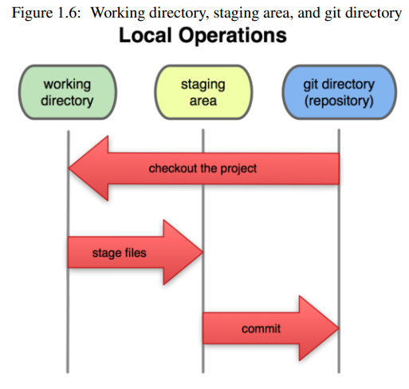
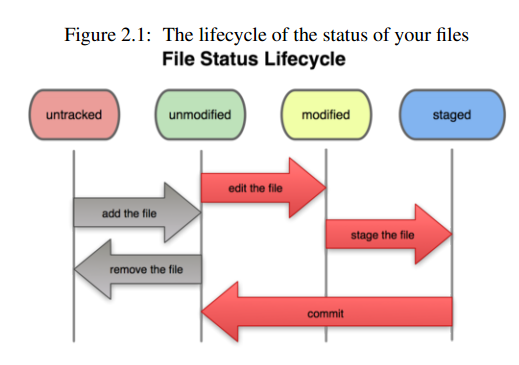

git使用教程与基本原理
________________________


[TOC]

## 认识Git

Q: 什么是GIT?

> Git是一个强调速度的分布式版本控制软件和源代码管理系统（SCM，source code management）。由Linus Torvalds为方便分布式开发linux而设计的管理软件。每一个Git工作目录都是一个带有完全历史记录和版本信息的仓库，不依赖网络和中央服务器。Git遵从GNU v2协议。

Q: 为什么要用GIT?

* 更顺畅的工作流程，开发过程中，完全可以离线操作
* 快速，Git分布式架构使得本地仓库包含所有的历史版本信息，你可以在不同的版本之间快速切换
* 弹性的本地分支，在SVN下，你建一个分支需要把源代码复制到另一文件夹下，在Git上你只需要一个命令
* 内容控元数据方式存储，所有的版本信息都位于`.git`目录下
* 完整性好，更易于协作开发
* 用户群大，现在已经有成千上万个开源项目采用Git来做项目管理，github上更是有无数个代码仓库

## 安装及初步使用

```bash
sudo apt-get install git;安装

git config --global user.name "xxx";设置用户名
git config --global user.email "xxx@xx.com";设置用户邮箱
git config --global core.editor vim;指定编辑器
git config --global merge.tool vimdiff;指定比对工作
git config --list;查看配置


ssh-keygen -t rsa;生成ssh连接公密钥，windows下请将文件放在git安装目录下的.ssh目录下
ssh git@github.com;测试ssh是否配转置成功
```


## Git仓库

Git做为一个资源管理和跟踪系统，如果想要把自己的文件托管在Git上，那么你得先让Git知道你需要管理的文件在哪。通过`cd`进入指定目录后，运行`git init`命令，就会在当前目录下生成`.git`目录，Git用来进行版本控制和内容跟踪的所有文件都在该文件夹下。
处于Git跟踪下的文件只有三种状态：

* Modified(working directory): 被修改过的文件
* Staged(staging area): 通过git add添加到暂存区域的文件
* Committed(git directory): 通过git commit提交到仓库的文件

所以，一般的git工作流程可能是这样：修改过某些文件，然后把这些文件都添加到暂缓区，再提交到仓库中形成一个版本或快照。最后提交到Git服务器上。而在中间，可能伴随分支管理，分支切换，撤消与合并。

可能有些人会觉得很奇怪，为什么Git会有暂存区域这个概念，直接提交到仓库中这就OK了。其实这是Git为了做版本控制用的。试想如果没有暂存区域，每修改一个文件，就会形成一个版本，太过频繁，不易于管理。暂存区域其实就是下一个版本的文件清单，你可以自由控制该往仓库中提交什么文件，这也可以避免在一个版本中包含一些中间文件，比如编译后的文件。






## Git基本操作

### 初始化仓库

```bash
git init;//创建新仓库
git clone [url];//从远程仓库克隆
git clone [path];//从本地仓库克隆，如git clone /home/www/test
```

### 添加文件

```bash
git add filename1 filename2;按文件名添加
git add -A .;添加所有
git add filename1;在文件被修改后，需要再次使用git add才会被commit
```

### 添加一个版本

```bash
git commit -m "commit message"
git commit -am "commit message";//将所有以前添加过并修改过的文件commit进去
```
> 关于`-a`参数的意义

> 其实`git add`命令只是指定文件的当前状态添加暂存区域，并不代表一个文件一时旦添加，就会一直存在每个版本中。如果你添加一个文件后对这个又进行了修改，在你`commit`时候，只会`commit`这个文件添加时的状态，不会把之后的修改也`commit`进去，除非你再次添加

### 推送变更

在你commit完之后，你可能想把自己的代码提交到github或者其他git服务器上，与他人交流共享，这时候就需要和远程服务器打交道了。

如果你是在本地建立起的仓库，默认情况下是没有任何服务器地址的，如果你是从其他服务器复制过来的仓库，这个服务器地址会自动添加到你的仓库中，你可以这样查看：

```bash
git remote -v;
git remote;//只会列出服务器的别名，不会列出地址
```

一个仓库可以有多个服务器地址，这就意味着，你可以从不同的人手中复制同一个仓库，但这并不会打乱你自己的分支。


合并其他代码到你的版本中，可以这样做：

```bash
git remote add code_a git@github.com:xxx/xxxx
git fetch code_a;也可以用pull code_a master
git merge code_a/master;fetch并不会合并代码
git push origin master
```

### 创建并管理分支

在做项目的时候，你可能会想写一些扩展性的功能，或者做一些小实验，但是你又不想影响你现在的项目。这个时候，你可以创建一个分支，然后在这个分支里写东西，当觉得不好的时候，你可以把这个分支删除掉，对你之前的主分支没有任何影响。或者你觉得这个新特性超出了自己的预想，可以合并到主分支里，这时候你只要把工作转回主分支，然后合并分支，最后删除分支，然后就跟没有那个分支一样。具体操作如下：

```bash
git branch test;创建一个test分支
git checkout test;切换到test分支,这两步操作也可以用git checkout -b test实现
;edit commit debug util merge

git checkout master;切换回master
git merge test;将test合并进master
git checkout -b test2;创建test2分支，并转到test2分支
git branch -d test;删除分支test
git branch;列出所有分支
git branch -v;列出所有分支及当前commit信息
```

> `git merge`实质是把两个版本合并在一起，然后在当前分支创建一个新的`commit`，如果你在两个分支的同一个文件的同一地方都做了修改，这时候`merge`就会失败，git就不会自动创建一个`commit`，而是直接停住。你需要手动修改这些冲突的文件，选择这两个分支中的一个版本，或者自己重写这个部分，然后手动添加这些文件到暂存区域，再`commit`就ok了。要查看哪些文件冲突了，可以用`git status`查看。

### 撤消改动

如果你提交太早，忘了添加某些文件，你可以这样做：
```bash
git commit -m "add something"
git add file1
git commit --amend -m "fix some bug";修改上一次的commit log
```

如果你添加了不该添加的文件，你可以这样挽回：

```bash
git add -A .
git reset HEAD readme.md;将reame.md中踢出Stage area
```

如果你编译错了一个文件，你想把它恢复到上一个版本的状态，你可以这样做：

```bash
git checkout -- readme.md;撤消这个文件的修改
git reset --hard HEAD^;滚回上一个版本
git reset --hard 版本号;滚回指定版本
```

如果你想回退远程分支，可以这样做：

```bash
git revert 版本号
```


### 其他资料

http://selfcontroller.iteye.com/blog/1786644

http://blog.csdn.net/qinjienj/article/details/7816047

http://blog.chinaunix.net/uid-9185047-id-445215.html

http://roclinux.cn/?p=622

http://blog.csdn.net/wengpingbo/article/details/8985132


